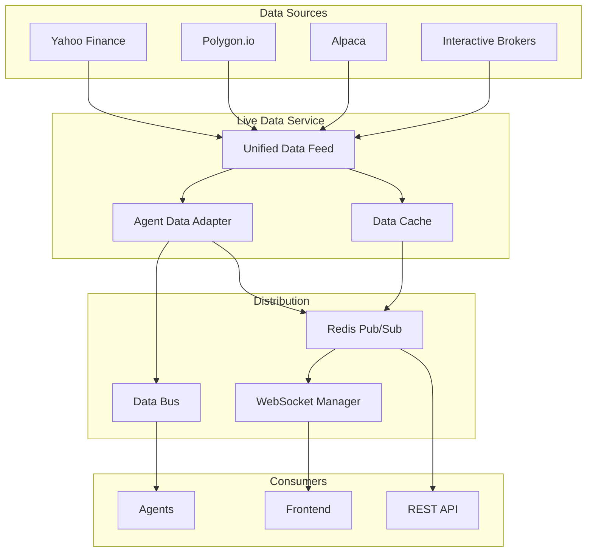

# 🚀 GoldenSignalsAI V3 - Complete Live Data Integration

## Overview

This document outlines the complete live data integration for GoldenSignalsAI V3, including real-time market data streaming, WebSocket connections, and multi-source data aggregation.

## Architecture



## Components

### 1. Live Data Service (`src/services/live_data_service.py`)

The main service that orchestrates all live data operations:

```python
# Configuration
live_data_config = LiveDataConfig(
    primary_source="yahoo",
    enable_polygon=True,
    symbols=['AAPL', 'GOOGL', 'TSLA', 'SPY', 'QQQ', 'NVDA', 'META', 'AMZN', 'MSFT'],
    update_interval=5,  # seconds
    options_update_interval=60  # seconds
)

# Initialize and start
live_data_service = LiveDataService(live_data_config)
await live_data_service.initialize()
await live_data_service.start()
```

### 2. WebSocket Service (`src/api/v1/websocket.py`)

Comprehensive WebSocket endpoints for real-time streaming:

- **Main endpoint**: `ws://localhost:8000/ws`
- **Market data**: `ws://localhost:8000/ws/market/{symbol}`
- **Signals**: `ws://localhost:8000/ws/signals`

### 3. Frontend WebSocket Client (`frontend/src/services/websocket.ts`)

Real WebSocket implementation with:
- Automatic reconnection
- Message queuing
- Heartbeat monitoring
- Subscription management

## Data Flow

### 1. Market Data Flow

```
Yahoo Finance → Live Data Service → Redis Cache → WebSocket → Frontend
                                  ↓
                                Agent Data Bus → Trading Agents
```

### 2. Signal Generation Flow

```
Market Data → Agents → Orchestrator → Signal Service → WebSocket → Frontend
                                                      ↓
                                                   Database
```

### 3. Options Data Flow

```
Options Chain → Live Data Service → Options Analysis → Unusual Activity Detection
                                                    ↓
                                                 Alerts → Frontend
```

## API Endpoints

### Market Data

```bash
# Real-time quote
GET /api/v1/market-data/{symbol}

# Historical data
GET /api/v1/market-data/{symbol}/historical?period=1D

# Options chain
GET /api/v1/market-data/{symbol}/options
```

### Live Data Metrics

```bash
# Service statistics
GET /metrics/live-data

# Health check
GET /health
```

## WebSocket Messages

### Client → Server

```javascript
// Subscribe to market data
{
  "type": "subscribe",
  "data": {
    "channel": "market_data",
    "symbol": "AAPL"
  }
}

// Request agent status
{
  "type": "request",
  "data": {
    "action": "agent_status"
  }
}
```

### Server → Client

```javascript
// Market data update
{
  "type": "market_data",
  "data": {
    "symbol": "AAPL",
    "price": 175.50,
    "bid": 175.48,
    "ask": 175.52,
    "volume": 45678900,
    "change": 2.50,
    "change_percent": 1.45
  },
  "timestamp": "2024-01-15T10:30:00Z"
}

// Signal update
{
  "type": "signal",
  "data": {
    "signal_id": "sig-123",
    "symbol": "AAPL",
    "signal_type": "BUY",
    "confidence": 0.85,
    "reasoning": "Strong momentum detected"
  },
  "timestamp": "2024-01-15T10:30:00Z"
}
```

## Configuration

### Environment Variables

```bash
# Data source API keys
POLYGON_API_KEY=your_polygon_key
ALPACA_API_KEY=your_alpaca_key
ALPACA_SECRET_KEY=your_alpaca_secret

# Redis configuration
REDIS_HOST=localhost
REDIS_PORT=6379

# WebSocket configuration
WS_PORT=8000
WS_HEARTBEAT_INTERVAL=30
```

### Frontend Configuration

```javascript
// .env
VITE_API_URL=http://localhost:8000
VITE_WS_URL=ws://localhost:8000/ws
```

## Usage Examples

### Frontend Integration

```typescript
import { useWebSocket } from './services/websocket';

function TradingDashboard() {
  const { subscribeToSymbol, isConnected } = useWebSocket();
  
  useEffect(() => {
    if (isConnected) {
      subscribeToSymbol('AAPL');
    }
  }, [isConnected]);
  
  // Component will receive real-time updates via store
}
```

### Backend Integration

```python
# Get live quote
quote = await live_data_service.get_quote("AAPL")

# Get options chain
options = await live_data_service.get_options_chain("AAPL")

# Access statistics
stats = live_data_service.get_statistics()
```

## Monitoring

### Health Checks

The system provides comprehensive health monitoring:

```json
{
  "status": "healthy",
  "database": "connected",
  "redis": "connected",
  "agents": "running",
  "live_data": {
    "status": "running",
    "quotes_fetched": 12450,
    "errors": 3,
    "uptime": "2:45:30"
  }
}
```

### Performance Metrics

- Quote fetch rate: ~1-5 seconds per symbol
- Options update rate: ~60 seconds
- WebSocket latency: <100ms
- Cache hit rate: >90%

## Error Handling

### Automatic Failover

```python
Primary Source (Yahoo) → Failover to Polygon → Cache Fallback
```

### Reconnection Strategy

- Exponential backoff: 5s, 7.5s, 11.25s... up to 30s
- Max attempts: 10
- Automatic resubscription on reconnect

## Security

### Authentication

- Optional JWT authentication for WebSocket connections
- API rate limiting per endpoint
- CORS configuration for frontend access

### Data Validation

- Input sanitization for symbols
- Price/volume validation
- Timestamp verification

## Deployment

### Docker Compose

```yaml
services:
  backend:
    environment:
      - POLYGON_API_KEY=${POLYGON_API_KEY}
      - REDIS_URL=redis://redis:6379
    depends_on:
      - redis
      
  redis:
    image: redis:7-alpine
    ports:
      - "6379:6379"
```

### Production Considerations

1. **Scaling**: Use Redis Cluster for high availability
2. **Load Balancing**: Deploy multiple backend instances
3. **Monitoring**: Integrate with Prometheus/Grafana
4. **Logging**: Centralized logging with ELK stack

## Troubleshooting

### Common Issues

1. **WebSocket Connection Failed**
   - Check CORS settings
   - Verify WebSocket URL
   - Check firewall/proxy settings

2. **No Market Data**
   - Verify API keys
   - Check market hours
   - Review rate limits

3. **High Latency**
   - Check Redis performance
   - Monitor network latency
   - Review data source response times

### Debug Mode

```python
# Enable debug logging
logging.getLogger("live_data_service").setLevel(logging.DEBUG)

# Monitor WebSocket connections
ws_manager.get_active_connections()

# Check data source status
for name, source in live_data_service.data_feed.sources.items():
    print(f"{name}: {'Connected' if source.is_connected else 'Disconnected'}")
```

## Future Enhancements

1. **Additional Data Sources**
   - Binance for crypto
   - Bloomberg Terminal integration
   - Custom data feeds

2. **Advanced Features**
   - Level 2 market data
   - Options Greeks calculation
   - Real-time news integration

3. **Performance Optimizations**
   - Protocol Buffers for data serialization
   - WebSocket compression
   - Edge caching with CDN

## Conclusion

The live data integration provides a robust, scalable foundation for real-time trading operations. With automatic failover, comprehensive monitoring, and efficient distribution mechanisms, the system ensures reliable data delivery for all trading agents and frontend applications. 